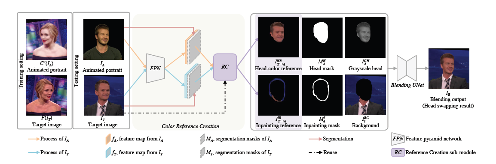
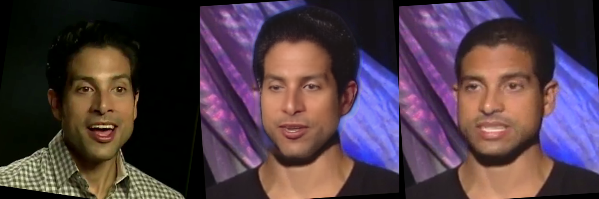

# HeSer.Pytorch
unofficial implementation of Few-Shot Head Swapping in the Wild<br>
you can find official version [here](https://github.com/jmliu88/HeSer)<br>
I did not use the discriminator from the paper and just follow [DCT-NET](https://github.com/LeslieZhoa/DCT-NET.Pytorch)


## enviroment
- torch
- opencv-python
- tensorboardX
- imgaug
- face-alignment
```shell
# download pretrain model
cd process
bash download_weight.sh
```
## How to RUN
### train
I only train one ID for driving
#### Data Process
1. download voxceleb2<br>
    a. I just download [voxceleb2 test dataset](https://www.robots.ox.ac.uk/~vgg/data/voxceleb/vox2.html), you can use this [website](https://www.robots.ox.ac.uk/~vgg/data/voxceleb/data/vox2_test_txt.zip)<br>
    b. You can unzip this file like this: 
    ```
    +--- dataset
    |   +--- vox2_test_txt
    |   |   +--- txt
    |   |   |   +--- id00017
    |   |   |   |   +--- 01dfn2spqyE
    |   |   |   |   |   +--- 00001.txt
    |   |   |   |   +--- 5MkXgwdrmJw
    |   |   |   |   |   +--- 00002.txt
    |   |   |   |   +--- 7t6lfzvVaTM
    |   |   |   |   |   +--- 00003.txt
    |   |   |   |   |   +--- 00004.txt
    |   |   |   |   |   +--- 00005.txt
    |   |   |   |   |   +--- 00006.txt
    |   |   |   |   |   +--- 00007.txt

    ```
    c. Install yt-dlp and aria2c by yourself. I think you can do that through internet.
    ```
    cd process
    python download_and_process.py
    ```
    d. the dataset is like:
    ```
    voceleb2/
    |-- id00017
    |   |-- 01dfn2spqyE
    |   |   `-- 00.npy
    |   |-- 5MkXgwdrmJw
    |   |   |-- 00.npy
    |   |   `-- 5MkXgwdrmJw.mp4
    |   |-- 7t6lfzvVaTM
    |   |   |-- 00.npy
    |   |   |-- 01.npy
    |   |   |-- 02.npy
    |   |   |-- 03.npy
    |   |   |-- 04.npy
    |   |   |-- 05.npy
    |   |   |-- 06.npy
    |   |   |-- 07.npy
    |   |   |-- 08.npy
    |   |   |-- 09.npy
    |   |   `-- 7t6lfzvVaTM.mp4
    ```
2. crop and align
    ```
    cd process 
    python process_raw_video.py
    ```
    the dataset is like: 
    ```
    process/
    |-- img
    |   |-- id00017
    |   |   |-- 5MkXgwdrmJw-0000
    |   |   |   |-- 1273.png
    |   |   |   |-- 1274.png
    |   |   |   |-- 1275.png
    |   |   |   |-- 1276.png
    |   |   |   |-- 1277.png
    |   |   |   |-- 1278.png
    |   |   |   |-- 1279.png
    |   |   |   |-- 1280.png
    |   |   |   |-- 1281.png
    |   |   |   |-- 1282.png
    |   |   |   |-- 1283.png
    |   |   |   |-- 1284.png
    |   |   |   |-- 1285.png
    |   |   |   |-- 1286.png
    |   |   |   |-- 1287.png
    |   |   |   |-- 1288.png
    |   |   |   |-- 1289.png
    ```
3. Remove data below threshold
    ```
    cd process
    python filter_idfiles.py
    ```
4. face parsing<br>
    follow [LVT](https://github.com/LeslieZhoa/LVT) to get face parsing<br>
    the mask data is like:
    ```
    process/mask/
    |-- id00017
    |   |-- 5MkXgwdrmJw-0000
    |   |   |-- 1273.png
    |   |   |-- 1274.png
    |   |   |-- 1275.png
    |   |   |-- 1276.png
    |   |   |-- 1277.png
    |   |   |-- 1278.png
    |   |   |-- 1279.png
    |   |   |-- 1280.png
    ```
#### Train Align
I just use id00061 to train align<br>
check [model/AlignModule/config.py](model/AlignModule/config.py#L1) to put your own path and params<br>
for single gpu
```
python  train.py --model align --batch_size 8 --checkpoint_path checkpoint --lr 2e-4 --print_interval 100 --save_interval 100 --dist
```
for multi gpu
```
python -m torch.distributed.launch train.py --model align --batch_size 8 --checkpoint_path checkpoint --lr 2e-4 --print_interval 100 --save_interval 100
```
#### Train Blend
check [model/BlendModule/config.py](model/BlendModule/config.py#L1) to put your own path and params<br>
for single gpu
```
python  train.py --model blend --batch_size 8 --checkpoint_path checkpoint --lr 2e-4 --print_interval 100 --save_interval 100 --dist
```
for multi gpu
```
python -m torch.distributed.launch train.py --model blend --batch_size 8 --checkpoint_path checkpoint --lr 2e-4 --print_interval 100 --save_interval 100
```
## Inference
follow inference.py, change your own model path and input images<br>
```shell
python inference.py
```
## Show
The result is just overfitting


## Credits
DCT-NET model and implementation:<br>
https://github.com/LeslieZhoa/DCT-NET.Pytorch Copyright © 2022, LeslieZhoa.<br>
License https://github.com/LeslieZhoa/DCT-NET.Pytorch/blob/main/LICENSE

latent-pose-reenactment model and implementation:<br>
https://github.com/shrubb/latent-pose-reenactment Copyright © 2020, shrubb.<br>
License https://github.com/shrubb/latent-pose-reenactment/blob/master/LICENSE.txt

arcface pytorch model pytorch model and implementation:<br>
https://github.com/ronghuaiyang/arcface-pytorch Copyright © 2018, ronghuaiyang.<br>

LVT model and implementation:<br>
https://github.com/LeslieZhoa/LVT Copyright © 2022, LeslieZhoa.<br>

face-parsing model and implementation:<br>
https://github.com/zllrunning/face-parsing.PyTorch Copyright © 2019, zllrunning.<br>
License https://github.com/zllrunning/face-parsing.PyTorch/blob/master/LICENSE